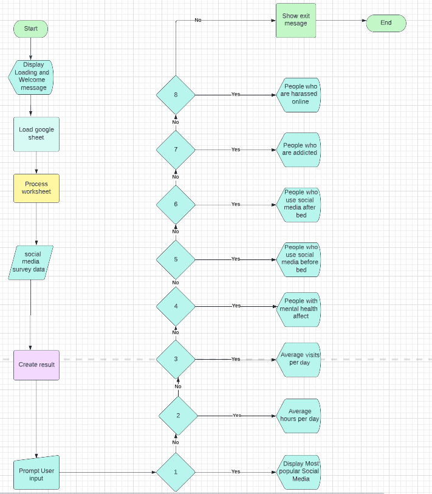

# Social media survey

Social media has become such an integral part of everyone’s life that it has almost become an addiction for most. Nearly 45% of the world's population can be found on social media according to a recent research report.

[Click here to go to the live website!](https://social-media-survey-analysis.herokuapp.com/)
## Table of contents 

1. [Program Flow](#Flow chart)
    - [Objectives](#objectives)
2. [Color scheme](#color-scheme)

The Color scheme used to display the input are yellow("\u001b[33") 
3. [Features](#features)
    - [Welcome message](#welcome-message)
    - [Instructions](#instructions) 
    - [Goodbye message](#goodbye-message)
4. [Testing](#testing)
    - [Python](#python-validator)
    - [Manual Testing](#manual-testing)
    - [Bugs](#bugs)
5. [Deployment](#deployment)
6. [Finished product](#finished-product)
7. [Credits](#credits)
    
## Flow chart

### Objectives

The main objective of this project is to analyse the social media survey days that resides in a google sheet. The sheet has data collected from people that in diverse age group and question and answers related to their Social media usage. As part of the analysis the program determines various metrics such as average time spent by a person per day for example.

## Color scheme

Text | Color 
--- | --- 
Loading message | General text, Blue ("\033[1;34m").
Welcome message | 
User prompt | 
Analyis result |

## Features

### Welcome message
On entering the application, the user is presented with a Welcome and Loading message. While the loading message is in progress, the program connects to Google Sheet and opens the work sheet and also processes the data. This is done so that the data is processed only once at the start of the application.

### Instructions
On successful loading and processing of the data, the user is presented with instructions as to what options to select to get various analysed data. There are options from 1 to 8. If any other key is entered then the program exits.

### Multiple User Prompt
The user can get one particular data at a time. For example if they select 1, then the Most popular Social media data is shown. Then the program prompts the user to enter a different option so that the user can keep seeing other analysis results. This is achieved by using a while loop.

### Goodbye message
After getting and viewing all the analysed data, when the user selects any other key then then a Thank you message is printed and the program exits.

## Testing

### Python Validator
The Python programs were statically analyed tested using PEP8 [PEP8 validator](http://pep8online.com/) 

The Python results came back with the following:

- 7x line too long 

- To fix this I edited the long lines and made them into multiple shorter lines within the same print/input statement:
    - Before example:
     

    - After example:
     

- I then retested with PEP8 and it came back clear:
 

### Manual Testing 

## Deployment 

There were many steps to deploying this project to Heroku:

1. If I had installed any packages to Gitpod, I would need to add then to a list of requirements. 
- To do this I would have typed pip3 freeze > requirements.txt and hit enter, this would update the requirements.txt file.
- I'd need to commit and push this to Github.
- Heroku will use this list to install the dependencies into the application before the project is run.
- However, I didn't need to do this as I had no packages installed.
2. I went over to my Heroku dashboard and clicked on 'create a new app'.
3. I chose a name for my app; every app must have a unique name so I called it social media survey analysis.
4. Selected my region and clicked create app. 
5. I then went to the tab at the top of the page and clicked on settings. 
6. Some apps will include sensitive data in the gitpod workspace that isn't in the github repository because it has been deliberately protected in the gitignore.file. I didn't have any sensitive data to protect but if I had done, I would have needed to create a config var to allow Heroku access to this data. 
 - To do this, I would have clicked reveal config vars.
 - Filled in the key for example: CREDS
 - Then copy and pasted the contents of that 'CREDS' file into the value field and clicked add. 
7. I added the buildpacks needed by clicking on the buildpack button.
 - Here I selected python and pressed save changes.
 - Then repeated the same process but selected nodejs this time.
 - making sure it was done in that order with python at the top and nodejs under.
8. I scrolled back up to the tab at the top and clicked deploy.
9. I selected github as the deployment method and clicked connect to github.
10. Once this is selected, I then searched for my github repository name, and connected to the correct repository.
11. Then I scrolled down, here there were two options.
 - The first option being to enable automatic deployment, which means that Heroku will rebuild the app every time I pushed a change to github.
 - The other option being to manually deploy, which is the choice I went for with this project.
12. When all the code is received from github there is a view button that it a link to the running app, I clicked this to make sure everything was running as expected.

Go back to [Table of contents](#table-of-contents)
## Credits 

[Lucid chart](https://www.lucidchart.com/pages/) - Lucid chart was used to create flowchart for designing my project.

[PEP8 validator](http://pep8online.com/) - Pep8 validator is used to validate the code.

[Google](https://www.google.ie/) - I used Google to get an idea for my project.

Mentor - I thank my mentor Marcel for his support and guidance for this project.  
