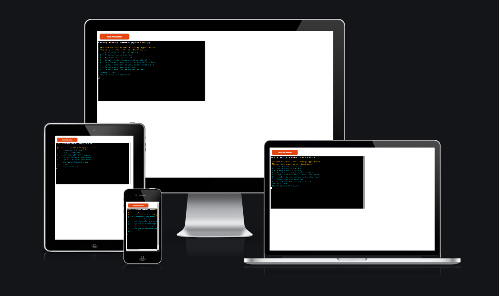
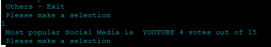
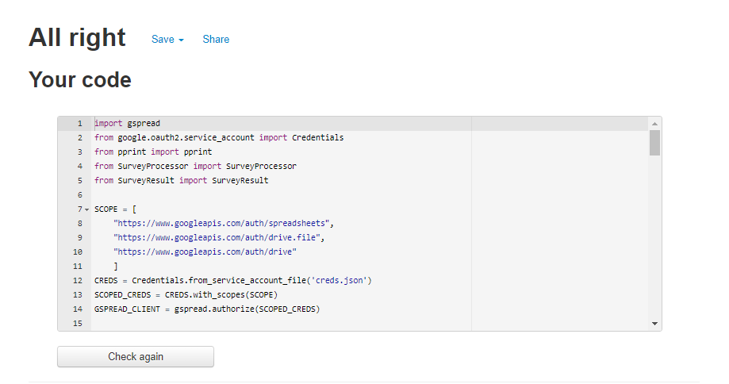
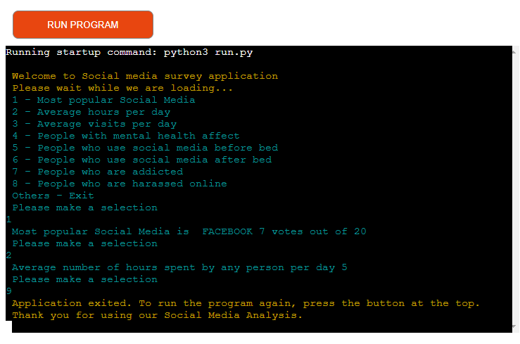

# Social media survey

Social media has become such an integral part of everyone’s life that it has almost become an addiction for most. Nearly 45% of the world's population can be found on social media according to a recent research report.According to the recent study in 2020, there are 3.5 billion active social media users worldwide which are about 45 percent of the total population. Social media has both, positive and negative effects. For example, social media can be an excellent platform to advertise products and services too.It honestly depends on an individual how to use this platform.

[Click here to go to the live website!](https://social-media-survey-analysis.herokuapp.com/)

[Click here to go to the Google sheet having the survey data!](https://docs.google.com/spreadsheets/d/1Jo2oCioJp7cLXBOX49ZvRMVBC9EUL7urbWd9FqvNPfw/edit?usp=sharing)

## Table of contents 

1. [Objective](#objectives)
2. [Program flow](#Flow-chart)
    - [Object Oriented](#object)
3. [Color scheme](#color-scheme)
4. [Features](#features)
    - [Welcome message](#welcome-message)
    - [Instructions](#instructions)
    - [Multiple user data](#multiple-user-prompt)
    - [Goodbye message](#goodbye-message)
5. [Utilities used](#utilities-used)
6. [Testing](#testing)
    - [Python](#python-validator)
    - [Manual Testing](#manual-testing)
    - [Bugs](#bugs)
7. [Deployment](#deployment)
8. [Finished product](#finished-product)
9. [Credits](#credits)

## Objective

The main objective of this project is to analyse the social media survey days that resides in a google sheet. The sheet has data collected from people that in diverse age group and question and answers related to their Social media usage. As part of the analysis the program determines various metrics such as average time spent by a person per day for example.

## Flow chart

## Object

### SurveyProcessor:
The responsibility of processing the sheet is given the python class called SurveyProcessor. This class' constructor takes in the google sheet as an argument. The google sheet is then processed by various methods in the SurveyProcessor.
### SurveyResult:
The result of the above processing is then stored in another class called SurveyResult. This class maintains a dictionary that holds the analysed data a key-value pair. This data can then be used easily when showing the result to the user.

## Color scheme

Text | Color 
--- | --- 
Loading message | General text, Yellow ("\u001b[31m")
Welcome message | General text, Yellow ("\u001b[31m")
User prompt     | General text, Cyan("\u001b[36m")
Analyis result  | General text, Cyan("\u001b[36m")

## Features

### Welcome message
On entering the application, the user is presented with a Welcome and Loading message. While the loading message is in progress, the program connects to Google Sheet and opens the work sheet and also processes the data. This is done so that the data is processed only once at the start of the application.

### Menu
On successful loading and processing of the data, the user is presented with instructions as to what options to select to get various analysed data. There are options from 1 to 8. If any other key is entered then the program exits.

### Multiple User Prompt
The user can get one particular data at a time. For example if they select 1, then the Most popular Social media data is shown. Then the program prompts the user to enter a different option so that the user can keep seeing other analysis results. This is achieved by using a while loop.

### Goodbye message
After getting and viewing all the analysed data, when the user selects any other key then then a Thank you message is printed and the program exits.

Go back to [Table of contents](#table-of-contents)

## Utilities Used

### gspread
gspread is a open source Python API for Google Sheets. This is used in the project to read the survey data from google sheet.

(https://docs.gspread.org/en/latest/)

### Google OAuth 2.0
google.oauth2.service_account is used for authentication while accessing the google sheet.

##  Testing

### Python Validator
The Python programs were statically analyed tested using PEP8 [PEP8 validator](http://pep8online.com/)

### run.py - before

### surveyProcessor.py - before

### surveyResult.py - before

Initially there were violations related to indentation and trailing white spaces. All these violations were later fixed.

###  run.py - after

### surveyProcessor.py - after

### surveyResult.py - after

### Manual Testing 

Scenario | Expected behaviour | Result 
--- | --- | ---
Launch the application | User should see the welcome message. | Pass
Check the Welcome message | Shows welcome message | Pass
Check Welcome message color | Displays in yellow color | Pass
Check the instructions | Shows instructions | Pass
Check instructions color| Displays in cyan color | Pass
Check whether user input was prompted | Shows the correct input data | Pass
Enter 1 | Most popular social media | Pass
Enter 2 | Average hours per day | Pass
Enter 3 | Average visits per day | Pass
Enter 4 | People with mental health affect | Pass
Enter 5 | People who use social media before bed | Pass
Enter 6 | People who use social media after bed | Pass
Enter 7 | People who are addicted | Pass
Enter 8 | People who are harassed online | Pass
Enter other keys | Program should exit | Pass
Enter other keys | Thank you mesage printed | Pass
Check Thank you message |Application exited. To run the program again, press the button at the top. Thank you for using our social media analysis  | Pass

## Deployment 

There were many steps to deploying this project to Heroku:

1. If I had installed any packages to Gitpod, I would need to add then to a list of requirements. 
- To do this I would have typed pip3 freeze > requirements.txt and hit enter, this would update the requirements.txt file.
- I'd need to commit and push this to Github.
- Heroku will use this list to install the dependencies into the application before the project is run.
- However, I didn't need to do this as I had no packages installed.
2. I went over to my Heroku dashboard and clicked on 'create a new app'.
3. I chose a name for my app; every app must have a unique name so I called it social media survey analysis.
4. Selected my region and clicked create app. 
5. I then went to the tab at the top of the page and clicked on settings. 
6. Some apps will include sensitive data in the gitpod workspace that isn't in the github repository because it has been deliberately protected in the gitignore.file. I didn't have any sensitive data to protect but if I had done, I would have needed to create a config var to allow Heroku access to this data. 
 - To do this, I would have clicked reveal config vars.
 - Filled in the key for example: CREDS
 - Then copy and pasted the contents of that 'CREDS' file into the value field and clicked add. 
7. I added the buildpacks needed by clicking on the buildpack button.
 - Here I selected python and pressed save changes.
 - Then repeated the same process but selected nodejs this time.
 - making sure it was done in that order with python at the top and nodejs under.
8. I scrolled back up to the tab at the top and clicked deploy.
9. I selected github as the deployment method and clicked connect to github.
10. Once this is selected, I then searched for my github repository name, and connected to the correct repository.
11. Then I scrolled down, here there were two options.
 - The first option being to enable automatic deployment, which means that Heroku will rebuild the app every time I pushed a change to github.
 - The other option being to manually deploy, which is the choice I went for with this project.
12. When all the code is received from github there is a view button that it a link to the running app, I clicked this to make sure everything was running as expected.

Go back to [Table of contents](#table-of-contents)

## Finished product

## Credits 

[Lucid chart](https://www.lucidchart.com/pages/) - Lucid chart was used to create flowchart for designing my project.

[PEP8 validator](http://pep8online.com/) - Pep8 validator is used to validate the code.

[w3schools](https://www.w3schools.com/python/default.asp) - I referred w3schools website to lookup some of Python features.

[gspread](https://docs.gspread.org/en/latest/user-guide.html) - gspread user guide was helpful too.

[questionpro](https://www.questionpro.com/survey-templates/social-media-survey/) - I referenced this website for the social media introduction.

Mentor - I thank my mentor Marcel for his support and guidance for this project.  

Go back to [Table of contents](#table-of-contents)

